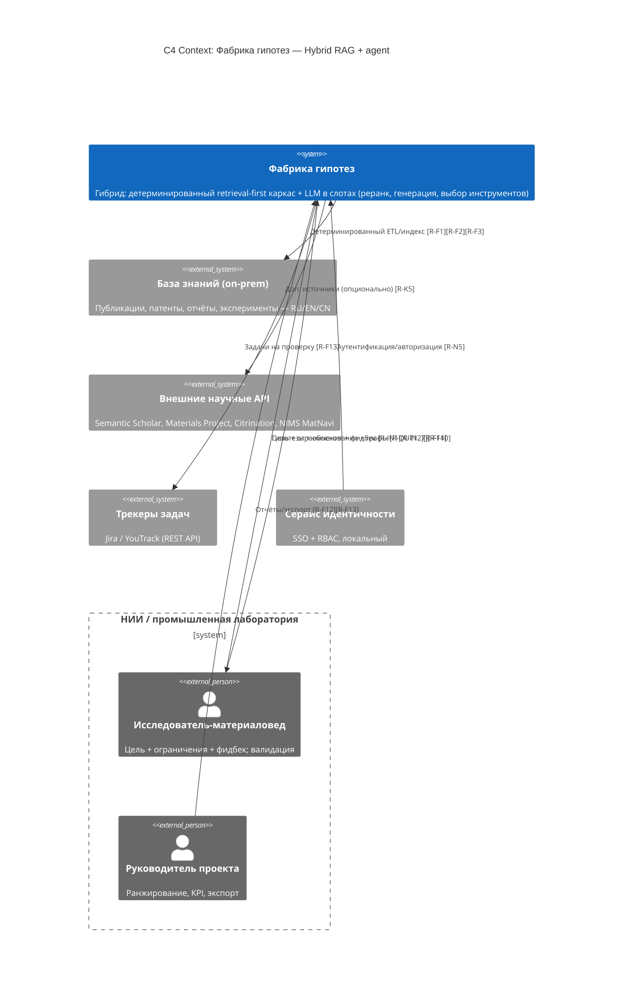

# C4 Context — Вариант 2 (Hybrid RAG + agent)

## Legend
- `Person_Ext` — внешняя роль; `System` — проектируемая система; `System_Ext` —
  внешние системы/границы. `Rel` — связь с тегами `[R-*]`.

## Компоненты и связи

| # | Элемент | Роль / примечание |
|---|---------|-------------------|
| 1 | Исследователь-материаловед | Главный пользователь [R-IN1..3][R-K1]; даёт фидбек [R-F14]. |
| 2 | Руководитель проекта | Ранжирование, KPI-отчёты, экспорт [R-F12][R-F13]. |
| 3 | База знаний (on-prem) | Локальный корпус; индексируется **детерминированно** (в отличие от V1). |
| 4 | Внешние научные API | Доп. источники; опциональны, отключаемы [R-N5]. |
| 5 | Трекеры задач | Jira/YouTrack; приёмник задач [R-F13]. |
| 6 | Сервис идентичности | SSO + RBAC [R-N5]. |
| sys | Фабрика гипотез | Гибрид: retrieval-first каркас + LLM-слоты (см. Container). |

**Отличие от V1**: граница «система ↔ база знаний» — не ленивый парсинг по
запросу агента, а **детерминированный ETL** с предbuilt-индексом и KG. LLM
работает внутри фиксированных слотов, а не управляет всем потоком.
