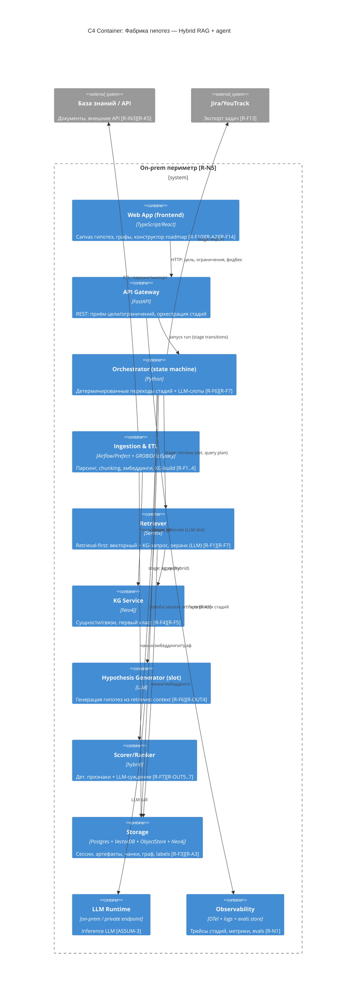

# C4 Container — Вариант 2 (Hybrid RAG + agent)

## Legend
- `Container` — runnable-единица. `System_Ext` — вне периметра.
- `Rel` — связь; подчёркнутое свойство — главная ответственность.
- Теги `[R-*]` — трассировка к требованиям.

## Компоненты и связи

| # | Контейнер | Технология | Роль | Требования |
|---|-----------|------------|------|------------|
| 1 | Web App | TypeScript/React | Canvas: графы, карточки, конструктор roadmap, фидбек. | [R-F10][R-A2][R-F14] |
| 2 | API Gateway | FastAPI | REST-шлюз; приём [R-IN1..3]; запуск run. | [R-N4][R-N5] |
| 3 | Orchestrator (state machine) | Python | Детерминированные переходы стадий; LLM-слоты в рамках стадии. | [R-F6][R-F7] |
| 4 | Ingestion & ETL | Airflow/Prefect + GROBID/SciSpacy | Парсинг, chunking, эмбеддинги, построение KG. | [R-F1..4][R-F3] |
| 5 | Retriever | Service | Retrieval-first: векторный + KG-запрос; LLM-реранк. | [R-F1][R-F7] |
| 6 | KG Service | Neo4j | Сущности/связи — первый класс; provenance. | [R-F4][R-F5] |
| 7 | Hypothesis Generator | LLM | Генерация гипотез из retrieved context (слот). | [R-F6][R-OUT4] |
| 8 | Scorer/Ranker | hybrid | Дет. признаки + LLM-суждение; веса [R-A1]. | [R-F7][R-OUT5..7] |
| 9 | Storage | Postgres + VectorDB + ObjectStore + Neo4j | Сессии, артефакты, чанки, граф, labels. | [R-F3][R-A3] |
| 10 | LLM Runtime | on-prem | Inference; изолирован. | [R-N5][ASSUM-3] |
| 11 | Observability | OTel + logs + evals | Трейсы стадий, метрики, evals. | [R-N1][R-N4] |
| 12 | База знаний / API | — | Внешние документы/API; опциональны. | [R-IN3][R-K5] |
| 13 | Jira/YouTrack | — | Приёмник задач. | [R-F13] |

**Ключевая особенность V2**: Orchestrator (3) — **стейт-машина**, не свободный
агент. Стадии фиксированы (retrieve → generate → score → explain → export); LLM
работает внутри слотов (7, 8, реранк в 5). Ingestion/ETL (4) и KG (6) —
**предbuilt** детерминированно, а не лениво. Это даёт воспроизводимость и контроль
контекста, уступая V1 в гибкости планирования.
