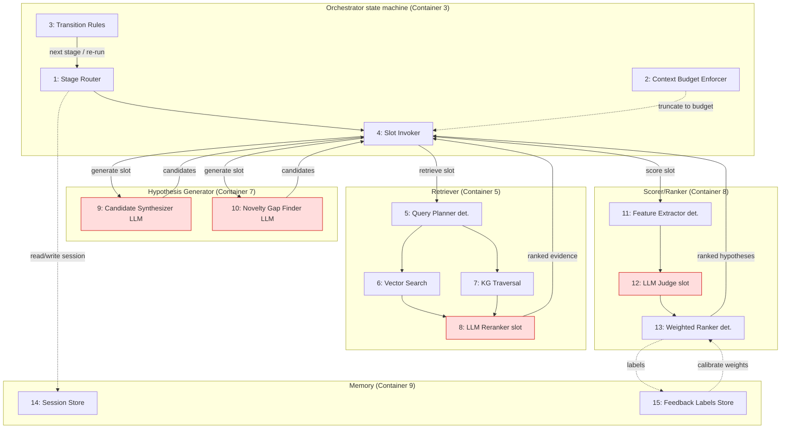

# C4 Component — Вариант 2 (Hybrid RAG + agent)

## Legend
- Красные узлы (`#fdd`) — LLM-слоты (семантические решения внутри детерминированной
  стадии). Прочие — детерминированные. Пунктир — доступ к памяти/калибровка.

## Компоненты и связи

| # | Компонент | Тип | Роль | Требования |
|---|-----------|-----|------|------------|
| 1 | Stage Router | deterministic | Выбор текущей стадии по стейт-машине. | [R-F6] |
| 2 | Context Budget Enforcer | deterministic | Токен-бюджет на слот; truncate/rerank evidence. | [R-N4] |
| 3 | Transition Rules | deterministic | Правила перехода стадий + re-run (canvas). | [R-F14] |
| 4 | Slot Invoker | deterministic | Вызов LLM-слотов с подготовленным контекстом. | [R-F6] |
| 5 | Query Planner | deterministic | Детерминированный план запросов из цели/ограничений. | [R-IN1][R-IN2] |
| 6 | Vector Search | deterministic | Плотный поиск чанков (RU/EN/CN). | [R-F1][R-N2] |
| 7 | KG Traversal | deterministic | Cypher/SPARQL обход графа сущностей/связей. | [R-F4] |
| 8 | LLM Reranker | `LLM/Agent` | Переранжирование evidence под цель. | [R-F7] |
| 9 | Candidate Synthesizer | `LLM/Agent` | Гипотезы из retrieved context (аналогии/контрфактуалы). | [R-F6][R-OUT4] |
| 10 | Novelty Gap Finder | `LLM/Agent` | Выявление пробелов в знаниях → гипотезы. | [R-F5] |
| 11 | Feature Extractor | deterministic | Новизна (граф. дистанция), реализуемость (constraint-match), эффект (KPI-прогноз). | [R-OUT5..7][R-IN2] |
| 12 | LLM Judge | `LLM/Agent` | Качественная оценка осей. | [R-F7] |
| 13 | Weighted Ranker | deterministic | Взвешенная сумма; веса [R-A1]; калибровка по labels. | [R-A1][R-A3] |
| 14 | Session Store | deterministic | Состояние run, артефакты стадий. | [R-F14] |
| 15 | Feedback Labels Store | deterministic | Метки фидбэка для калибровки. | [R-A3] |

**Распределение LLM vs deterministic**:
- `LLM/Agent` (слоты): #8 Reranker, #9 Synthesizer, #10 Gap Finder, #12 Judge.
- deterministic (каркас): #1,#2,#3,#4 (оркестрация), #5,#6,#7 (retrieval),
  #11,#13 (скоринг-каркас), #14,#15 (память).

> Обоснование позиции: детерминированный каркас даёт воспроизводимость и
> контроль контекста [R-N1][R-N4]; LLM-слоты — креативность там, где правила
  слабы (генерация, реранк, качественная оценка) [R-F5][R-F6]. Re-run стадии
  (canvas) поддержан transition rules #3 [R-F14].
