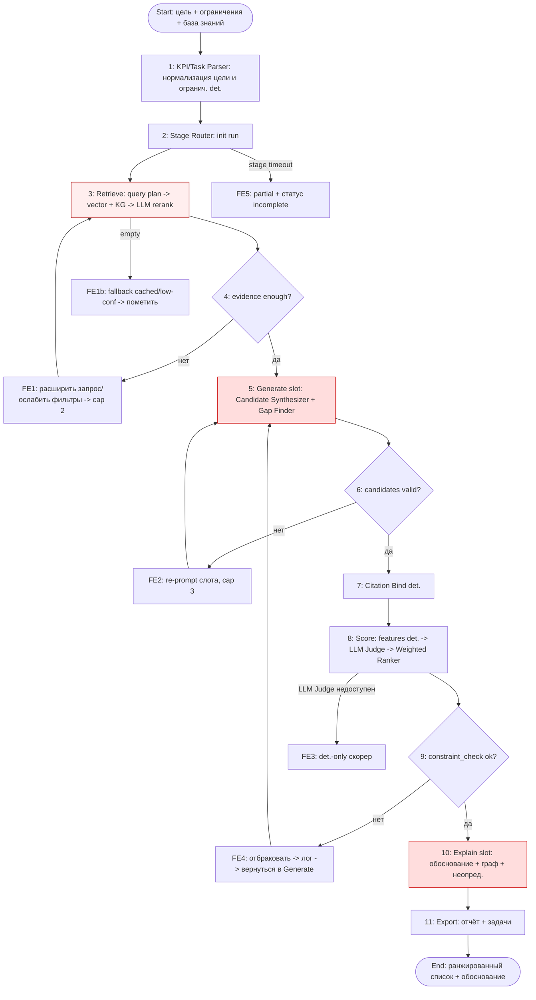

# Workflow — Вариант 2 (Hybrid RAG + agent)

## Legend
- Прямоугольники — стадии/шаги; ромбы — точки принятия решения. Красные
  (`#fdd`/`#fee`) — LLM-слоты; прочие — детерминированные. `FE*` — failure-ветки.

## Стадии и ветки ошибок

| # | Стадия | Тип | Роль | Требования |
|---|--------|-----|------|------------|
| 1 | KPI/Task Parser | deterministic | Нормализация цели [R-IN1] и ограничений [R-IN2]. | [R-IN1][R-IN2][ASSUM-4] |
| 2 | Stage Router init | deterministic | Старт run, выбор первой стадии. | [R-F6] |
| 3 | Retrieve | det.+`LLM/Agent` | Query plan → vector+KG → LLM rerank. | [R-F1][R-F4][R-F7] |
| 4 | evidence enough? | deterministic | Gate: достаточно ли evidence. | [R-N4] |
| 5 | Generate slot | `LLM/Agent` | Synthesizer + Gap Finder → кандидаты. | [R-F5][R-F6][R-OUT4] |
| 6 | candidates valid? | deterministic | Schema-проверка кандидатов. | [R-N1] |
| 7 | Citation Bind | deterministic | Привязка claim→source. | [R-F9][R-K2] |
| 8 | Score | det.+`LLM/Agent` | Features → LLM Judge → Weighted Ranker. | [R-F7][R-OUT5..7] |
| 9 | constraint_check | deterministic | Hard gate по ограничениям. | [R-IN2][R-K1] |
| 10 | Explain slot | `LLM/Agent` | Обоснование + граф + неопределённость. | [R-F8][R-F10][R-F11] |
| 11 | Export | deterministic | Отчёт + задачи. | [R-F12][R-F13] |

### Failure modes и fallback

| ID | Триггер | Fallback | Требование |
|----|---------|----------|------------|
| FE1 | evidence недостаточно | расширить запрос/ослабить фильтры, cap 2 → low-conf | [R-N3][R-N4] |
| FE1b | retrieve empty | cached/пусто → `low-confidence`, рекомендация до-сбора данных | [R-N3][R-F11] |
| FE2 | candidates invalid | re-prompt слота, cap 3 → отбраковать | [R-N1] |
| FE3 | LLM Judge недоступен | det.-only скорер (features + weighted ranker) | [R-F7] |
| FE4 | нарушение ограничений | отбраковать → лог → вернуться в Generate | [R-IN2][R-K1] |
| FE5 | stage timeout | partial + статус `incomplete` | [R-N4] |

**Stop conditions**: прохождение до Export (нормальный путь); stage timeout
(FE5); hard-ограничение нарушено без альтернатив (FE4 → end with status).
Re-run любой стадии поддержан canvas/transition rules [R-F14] — пользователь
может отредактировать промежуточный артефакт и перезапустить стадию.
