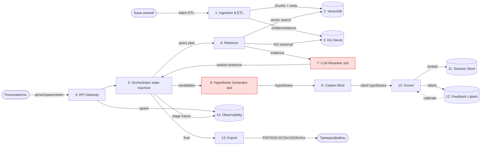

# Data Flow — Вариант 2 (Hybrid RAG + agent)

## Legend
- Красные узлы (`#fdd`) — LLM-слоты; прочие — детерминированные процессы.
  `[( )]` — хранилища. Сплошные — основной поток; пунктир — калибровка.

## Поток данных: что хранится и что логируется

| # | Узел | Что проходит | Что хранится | Что логируется | Тип |
|---|------|--------------|--------------|----------------|-----|
| 1 | Ingestion & ETL | документы (text/PDF/Excel/БД) | чанки, эмбеддинги, KG, метаданные [R-F3] | ETL-джоб статус, ошибки парсинга | deterministic |
| 2 | VectorDB | эмбеддинги | чанки + meta (RU/EN/CN) | — | deterministic |
| 3 | KG Neo4j | сущности/связи | граф с provenance | conflict-count | deterministic |
| 4 | API Gateway | цель/ограничения | — | запрос, user_id, t_start | deterministic |
| 5 | Orchestrator | state of run | состояние стадий, артефакты | stage spans, token usage per slot | det.+LLM |
| 6 | Retriever | query plan → evidence | — | hit-rate, latency, source IDs | deterministic |
| 7 | LLM Reranker | evidence | — | rerank delta, token usage | `LLM/Agent` |
| 8 | Hypothesis Generator | evidence → кандидаты | — | кандидаты, token usage | `LLM/Agent` |
| 9 | Citation Bind | claims + sources | claim→source_id | coverage, unmatched claims | deterministic |
| 10 | Scorer | кандидаты → оценки | — | scores, weights used | det.+LLM |
| 11 | Session Store | ранжированные гипотезы | артефакты run | event «hypothesis_stored» | deterministic |
| 12 | Feedback Labels | labels | accepted/rejected/adjusted | label-события, конфликты labels | deterministic |
| 13 | Export | финальный набор | файлы/задачи | экспорт-событие, формат, получатель | deterministic |
| 14 | Observability | spans/логи | трейсы, метрики, evals | — | deterministic |

### Память и контекст

- **Session Store** (краткосрочная, run): состояние стадий + артефакты; позволяет
  re-run стадии (canvas) [R-F14]. Context budget enforced per slot (#2 Enforcer).
- **Feedback Labels Store** (долгосрочная): метки фидбэка; калибруют веса
  Weighted Ranker (#13) [R-A3]. Без on-line fine-tuning [ASSUM-7].
- **Context budget**: каждый LLM-слот получает truncate/rerank evidence до
  фиксированного лимита токенов (см. `system-design.md`).

### Что НЕ делегируется LLM (детерминированные части потока)

- ETL/индекс/KG (1,2,3) — предbuilt детерминированно [R-F1..4].
- Query plan (6) — детерминированный из цели/ограничений [R-IN1][R-IN2].
- Citation Bind (9) — жёсткий мэтч [R-F9][R-K2].
- constraint_check — hard gate [R-IN2].
- Weighted Ranker (det. часть 10) — формула с весами [R-A1].
- Export (13) — форматирование/REST [R-F12][R-F13].

### Конфиденциальность данных

Все хранилища on-prem [R-N5]; эмбеддинги/KG из локальных данных. Внешние API —
опциональны, отключаемы [ASSUM-3]. Redaction в Observability (14): source IDs и
метрики, не сырые тексты.
